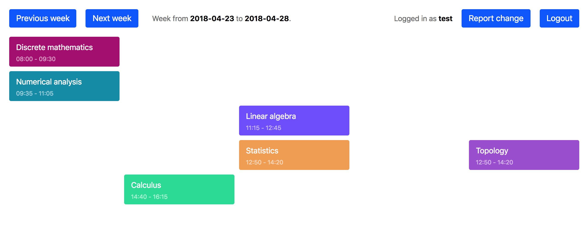

# schedule planner


*Work in progress*

App for viewing current schedule of a student, handling classes that are moved permanently, happen every N weeks, are moved occasionally and so on.

## Running
```bash
python manage.py makemigrations
python manage.py migrate
python manage.py runserver
```

## Summary

### Done
- setup the Django project
- create and connect to the database
- create basic models
- display calendar properly
- add username/password authentication
- create fixture containing realistic data
- add admin panel for managing change requests
- split models into separate files
- handle accept/decline buttons
- use CSRF protection
- handle one-time exceptions
- show events happening every two weeks only when they should be visible
- add user change report page
- split views into separate files
- split JS and some CSS in static files
- add icon pack

## Mini-docs
Application features:

### Models
- Event
- Student
- Teacher
- Subject
- ChangeRequest
- SingularChange

### Views
- homepage with calendar
- summary of user's reports
- new report form
- reports admin panel

## Database
*NOTE: migrations are not version controlled since development is dynamic and they would break too often. Auto generate them when needed.*

In case you are missing some of those:
```bash
sudo apt-get update
sudo apt-get install python-pip python-dev libpq-dev postgresql postgresql-contrib
```

Now you can create the database:
```bash
# Login into PostgreSQL shell
sudo su - postgres
psql

# Create the database and user
CREATE DATABASE schedule_planner;
CREATE USER schedule_planner_user WITH PASSWORD 'schedule_planner_password';

# Setup user
ALTER ROLE schedule_planner_user SET client_encoding TO 'utf8';
ALTER ROLE schedule_planner_user SET default_transaction_isolation TO 'read committed';
ALTER ROLE schedule_planner_user SET timezone TO 'UTC';

# Give the user all privileges
GRANT ALL PRIVILEGES ON DATABASE schedule_planner TO schedule_planner_user;

# Quit
\q
exit
```

Make sure you've installed both Django and psycop2 (the latter is not installed by default and is required to connect to the PostgreSQL database)
```
pip install django psycopg2
```

## Utilities
Show git stats (i.e. number of lines added/removed per file and global summary) from the initial commit until now:
```bash
git diff --stat d28d9970 HEAD
```

Create Django superuser:
```bash
python3 manage.py createsuperuser
```